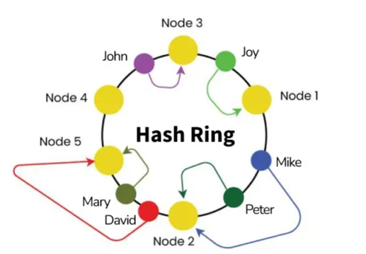
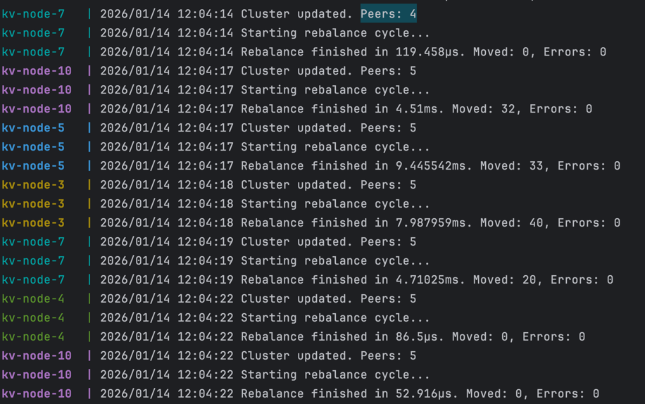

# distributed-kv-storage
Распределённое key-value хранилище с шардингом и поддержкой горизонтального масштабирования.   Каждый узел хранит часть данных, запросы могут выполняться через любой узел.   Поддерживаются операции: `PUT`, `GET`, `DELETE`, а распределение ключей определяется хеш-функцией.

### База
В проекте две составляющие: seed и kv-node.
1) kv-node - узел в котором хранится часть данных
2) seed - сервис, в котором хранится информация о том какие ноды сейчас работают

Сервисы в проекте запускаются в docker-compose.
```bash
docker compose up --build --scale kv-node=3
```
Обычной репликацией контейнера мы можем запустить несколько шардов!
Каждая нода торчит наружу - ей дается случайный порт из диапазона.
```bash
$ docker ps
CONTAINER ID   IMAGE                            COMMAND                  CREATED         STATUS         PORTS                                   NAMES
07a940d766a7   distributed-kv-storage-kv-node   "/app/kv-node /app/c…"   5 seconds ago   Up 5 seconds   8081-8100/tcp, 0.0.0.0:8013->8080/tcp   distributed-kv-storage-kv-node-5
b86f295fb32e   distributed-kv-storage-kv-node   "/app/kv-node /app/c…"   5 seconds ago   Up 4 seconds   8081-8100/tcp, 0.0.0.0:8014->8080/tcp   distributed-kv-storage-kv-node-4
77689fb30d2a   distributed-kv-storage-kv-node   "/app/kv-node /app/c…"   9 hours ago     Up 4 seconds   8081-8100/tcp, 0.0.0.0:8015->8080/tcp   distributed-kv-storage-kv-node-3
07ca90cb695e   distributed-kv-storage-seed      "/app/seed"              9 hours ago     Up 5 seconds   0.0.0.0:9000->9000/tcp                  seed
```
### KV-Node (Storage Node)
Нода локального in-memory хранилища
К каждой ноде можно делать следующие запросы:
- `PUT /put?key=<key>` — записать значение (body = value)
- `GET /get?key=<key>` — получить значение
- `DELETE /delete?key=<key>` — удалить ключ

```bash
# Запись данных через первую ноду
curl -X PUT -d "John Doe" "http://localhost:8013/put?key=user_123"

# Чтение через другую ноду (автоматическое проксирование)
curl "http://localhost:8014/get?key=user_123"
# -> John Doe

# Удаление
curl -X DELETE "http://localhost:8015/delete?key=user_123"

# Проверка удаления
curl "http://localhost:8013/get?key=user_123"
# -> 404 Not Found
```
### Алгоритм работы
1) kv-node запускается и идет в seed, чтобы зарегистрироваться, в ответ получает свой id и список всех активных нод
2) раз в 5 секунд kv-node ходит в seed, чтобы подтвердить, что она работает и получить обновленный список активных kv-node
3) если в течение 15 секунд к seed не пришла нода, то он считает, что она не активная

### Хэш функця
Во время добавления/удаления нод изменяется значение хэш функции, поэтому нужна была такая, что при таких активностях перераспределение ключей было минимальным.

Consistent hashing

Я сделал Consistent hashing с виртуальными нодами, для меньшей зависимости от хэш-функции - по 128 виртуальных нод в кольце на одну физическую.

Пример ребансировки при добавлении ноды

Общий объем ключей был 800. Можно заметить что нода получила 125. У нод в среднем по 160 ключей.

При удалении нод ребалансировки не происходит, мы просто теряем данные.